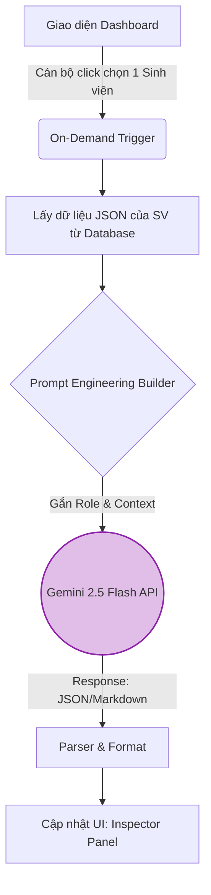

# Tài Liệu Kỹ Thuật: AI Reasoning (Bộ Não Lập Luận AI)
**Dự án:** SV5T Smart - AI-Powered Student Evaluation & Review System  
**Phụ trách module:** Tâm  
**Phiên bản:** 1.0.0  

---

## 1. Tổng quan (Overview)
Module **AI Reasoning** (`backend/reasoning.py`) sử dụng sức mạnh của mô hình **Gemini 2.5 Flash** để đóng vai trò như một Trợ lý ảo cho Hội đồng kiểm định. 
Thay vì chỉ báo `PASS/FAIL` một cách máy móc, module này sẽ đọc hiểu toàn bộ hồ sơ ứng viên, phân tích các điểm mạnh/yếu, dò tìm các rủi ro gian lận (Fraud Detection), và tự động soạn thảo một "Biên bản giải trình" bằng ngôn ngữ tự nhiên để hỗ trợ cán bộ đưa ra quyết định cuối cùng.

> **💡 Lưu ý thiết kế:** Hệ thống áp dụng triết lý *AI-Assisted, Not Decision-Maker*. Trí tuệ nhân tạo chỉ đưa ra khuyến nghị (Recommendation), quyền bấm nút phê duyệt (`APPROVED/REJECTED`) hoàn toàn thuộc về con người.

## 2. Sơ đồ luồng (Flowchart)
Hệ thống áp dụng cơ chế **Lazy AI Evaluation (Chấm lười)** để tối ưu chi phí API và tránh lỗi quá tải.



## 3. Thiết kế Prompt Engineering (Kỹ thuật Đặt câu hỏi)
Hệ thống không ném dữ liệu thô cho AI mà sử dụng kỹ thuật **Role-Prompting** kết hợp **Few-Shot Prompting**.

* **System Prompt (Vai trò):** *"Bạn là một chuyên gia kiểm định hồ sơ cấp Trung ương. Nhiệm vụ của bạn là đánh giá khách quan, công tâm và nghiêm ngặt hồ sơ Sinh viên 5 Tốt dựa trên dữ liệu được cung cấp."*
* **Context Payload (Dữ liệu nạp vào):** Hệ thống sẽ chuyển đổi bản ghi của sinh viên từ DB (kèm theo kết quả `PASS/FAIL` của Rule Engine) thành một chuỗi JSON chuẩn xác và nạp vào Prompt.
* **Output Instruction (Lệnh ép định dạng):** Yêu cầu Gemini trả về phản hồi dưới dạng cấu trúc Markdown chia đoạn rõ ràng (Điểm sáng, Điểm yếu, Đánh giá rủi ro, Khuyến nghị).

## 4. Cấu trúc dữ liệu (Data Dictionary)

**Đầu ra mong đợi từ AI (Output Mẫu):**
```markdown
### 🌟 Điểm sáng nổi bật
- Hoàn thành xuất sắc tiêu chí Học tập với GPA đạt **3.9/4.0** và có **1 Bài báo khoa học** (vượt chuẩn).
- Điểm rèn luyện tuyệt đối (100/100).

### ⚠️ Rủi ro & Cần hậu kiểm (Risk Flags)
- 🚩 **Giờ tình nguyện:** Ứng viên khai báo 150 ngày tình nguyện. Con số này cao bất thường so với thời lượng học tập, cán bộ cần yêu cầu xuất trình giấy xác nhận của Đoàn trường.

### 🎯 Khuyến nghị (Recommendation)
- **Tình trạng:** Tiềm năng đạt giải cao.
- **Hành động:** `MANUAL_REVIEW` (Đưa ra Hội đồng xem xét lại minh chứng tình nguyện).
```

## 5. Cơ chế xử lý ngoại lệ (Error Handling & Rate Limits)
Làm việc với API bên ngoài luôn tiềm ẩn rủi ro về mạng và giới hạn truy cập. Module này áp dụng các cơ chế bảo vệ sau:
* **Quota Exceeded (Lỗi 429):** Nhờ cơ chế "Lazy AI" (chỉ gọi API khi cán bộ click xem chi tiết 1 hồ sơ), hệ thống triệt tiêu hoàn toàn rủi ro sập luồng do gọi hàng loạt.
* **Timeout / Rớt mạng:** Cấu hình thời gian chờ tối đa (timeout = 20s). Nếu API Gemini không phản hồi, hệ thống bắt lỗi (try-catch) và render một dòng thông báo lỗi thân thiện trên UI: *"Hệ thống AI đang bận, vui lòng chỉ xem kết quả đánh giá từ Rule Engine."*
* **Lỗi định dạng trả về:** Sử dụng Regex để làm sạch chuỗi Markdown do AI trả về trước khi render lên Streamlit để tránh vỡ giao diện.

## 6. Phụ thuộc (Dependencies)
* **Thư viện chính:** `google-generativeai` (SDK chính thức của Google).
* **Bảo mật:** Yêu cầu phải có `GEMINI_API_KEY` cấu hình trong file `.env`. Tuyệt đối không hardcode API Key vào file `reasoning.py`.
* **Giao tiếp:** Được trigger trực tiếp từ `frontend/app.py` khi có sự kiện (event) click vào hàng đợi.