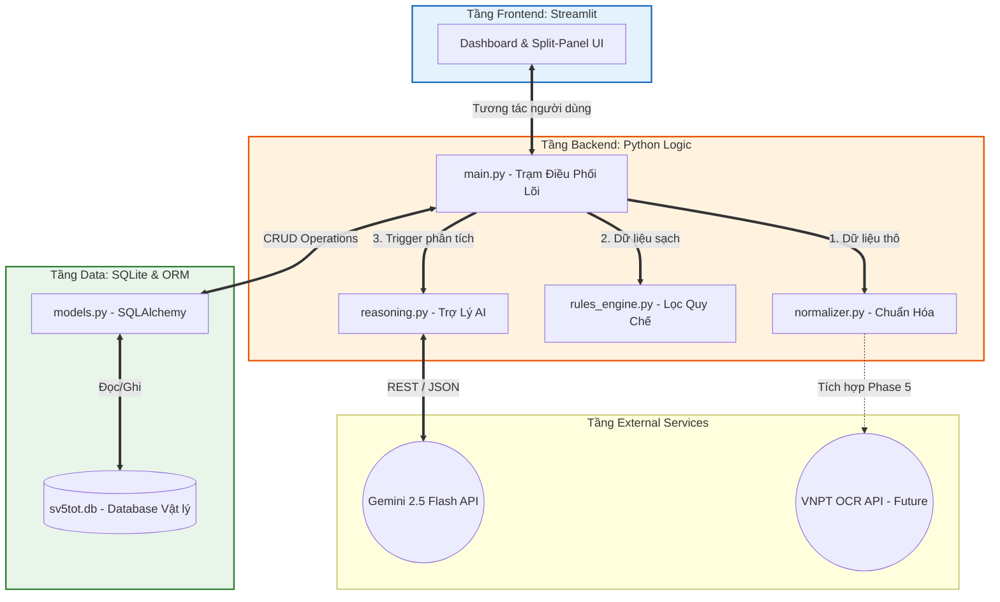

# Tài Liệu Kỹ Thuật: Kiến Trúc Hệ Thống (System Architecture)
**Dự án:** SV5T Smart - AI-Powered Student Evaluation & Review System  
**Phụ trách kiến trúc:** Tâm  
**Phiên bản:** 1.0.0  

---

## 1. Tổng quan Kiến trúc (Overview)
**SV5T Smart** được thiết kế theo kiến trúc **Monolithic Modular** (Nguyên khối phân rã module). Nghĩa là toàn bộ mã nguồn nằm trong một dự án duy nhất để dễ triển khai (phù hợp với giai đoạn MVP), nhưng các logic nghiệp vụ được tách bạch hoàn toàn thành các module độc lập.

Sự tách bạch này (Separation of Concerns) giúp hệ thống:
1. **Dễ bảo trì:** Đổi giao diện không làm ảnh hưởng đến cơ sở dữ liệu.
2. **Dễ nâng cấp:** Sẵn sàng chuyển đổi thành kiến trúc Microservices khi hệ thống mở rộng quy mô.
3. **Cô lập lỗi:** Sập kết nối AI API không làm chết luồng duyệt quy chế cứng nội bộ.

## 2. Sơ đồ Kiến trúc Tổng thể (Architecture Diagram)

## 3. Cấu trúc Các Tầng (Layered Architecture)

### Tầng 1: Presentation Layer (Frontend)
* **Công nghệ:** Streamlit (`frontend/app.py`).
* **Chức năng:** Trực quan hóa dữ liệu, cung cấp môi trường tương tác để người dùng (cán bộ xét duyệt) upload file, xem báo cáo, và đưa ra quyết định cuối cùng (`APPROVED`, `REJECTED`).

### Tầng 2: Application / Business Logic Layer (Backend)
* **Trạm điều phối (`main.py`):** Nhận request từ UI, phân phối task cho Normalizer, Rule Engine, và Reasoning.
* **Quy tắc cứng (`rules_engine.py`):** Đánh giá các tiêu chí toán học chuẩn xác, tuyệt đối (Vd: GPA >= 3.6).
* **AI Lập luận (`reasoning.py`):** Xử lý ngôn ngữ tự nhiên, phân tích ngữ nghĩa, đánh giá rủi ro mềm.

### Tầng 3: Data Access Layer (Database)
* **Công nghệ:** SQLite + SQLAlchemy ORM (`database.py`, `models.py`, `init_db.py`).
* **Cơ chế đặc biệt:** Sử dụng Absolute Path (đường dẫn tuyệt đối qua `os.path`) để khóa vị trí file `sv5tot.db`, ngăn chặn tình trạng thất lạc file dữ liệu khi khởi chạy ứng dụng từ các môi trường terminal khác nhau.

## 4. Thiết lập & Khởi tạo (Setup & Initialization)
Để hệ thống vận hành trơn tru, các tầng cần được liên kết theo trình tự sau:
1. **Môi trường ảo:** Cài đặt các gói phụ thuộc từ `requirements.txt`.
2. **Biến môi trường (`.env`):** Nạp khóa API (Gemini, BTC).
3. **Khởi tạo CSDL:** Chạy `init_db.py` để SQLAlchemy ánh xạ các schema trong `models.py` thành bảng vật lý trong SQLite.
4. **Khởi động server:** Khởi chạy cổng UI qua Streamlit.

## 5. Cơ chế Xử lý Ngoại lệ Tổng thể (System-Level Error Handling)
* **Graceful Degradation (Suy giảm nhẹ):** Nếu tầng External Services (như Gemini API) bị sập mạng hoặc hết quota (Lỗi 429), hệ thống sẽ không sụp đổ toàn bộ. Tầng UI vẫn hiển thị kết quả đậu/rớt của Rule Engine (CPU nội bộ) kèm thông báo "AI đang bảo trì", cho phép cán bộ tiếp tục công việc duyệt thủ công.
* **Database Locking (Lỗi khóa DB):** Mọi giao dịch lưu kết quả vào SQLite đều được bọc bằng hàm `Session.commit()` chuẩn ORM kết hợp Try-Catch để rollback nếu xảy ra xung đột khi thao tác hàng loạt.

## 6. Phụ thuộc (Tech Stack Dependencies)
- Hệ điều hành: Đa nền tảng (Windows / Linux / MacOS).
- Ngôn ngữ: Python 3.11+
- Cơ sở dữ liệu: SQLite3.
- Core Frameworks: `streamlit` (UI), `sqlalchemy` (ORM), `pandas` (ETL), `google-generativeai` (AI SDK).