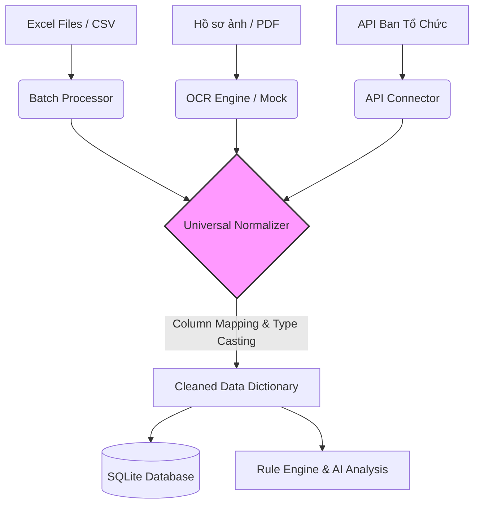

# Tài Liệu Kỹ Thuật: Data Pipeline & OCR
**Dự án:** SV5T Smart - AI-Powered Student Evaluation & Review System  
**Phụ trách module:** Tâm  
**Phiên bản:** 1.1.0  

---

## 1. Tổng quan (Overview)
Module **Data Pipeline & OCR** đóng vai trò là "cửa ngõ" dữ liệu của toàn bộ hệ thống SV5T Smart. Nhiệm vụ chính của module này là tiếp nhận dữ liệu sinh viên từ nhiều nguồn khác nhau (Excel, hệ thống của Ban tổ chức, hồ sơ giấy qua OCR), sau đó làm sạch, đồng bộ và chuẩn hóa về một định dạng thống nhất duy nhất trước khi đưa vào Cơ sở dữ liệu (`database.py`) và bộ máy đánh giá (`rules_engine.py`).

## 2. Kiến trúc và Luồng dữ liệu (Data Flow)
Dữ liệu đầu vào bất kể từ nguồn nào đều phải đi qua `Universal Normalizer` để đảm bảo tính toàn vẹn.



## 3. Cấu trúc Mapping & Chuẩn hóa (Data Dictionary)
Hệ thống sử dụng cơ chế Dynamic Mapping thông qua file JSON để giải quyết bài toán biểu mẫu Excel không đồng nhất giữa các Khoa/Trường.

**Cấu hình `mapping.json` chuẩn (Đã map với Rule Engine):**
```json
{
  "student_id": ["mã số sinh viên", "mssv", "mã sv", "student id", "id"],
  "student_name": ["họ và tên", "họ tên", "tên sinh viên", "name"],
  "university": ["trường", "đại học", "university", "đơn vị"],
  "gpa": ["điểm học tập", "trung bình tích lũy", "gpa", "điểm tb", "điểm hệ 4"],
  "conduct_score": ["điểm rèn luyện", "đrl", "điểm rl"],
  "ielts": ["trình độ ngoại ngữ", "tiếng anh", "ielts", "toeic", "chứng chỉ ngoại ngữ"],
  "volunteer_days": ["số ngày tình nguyện", "ngày tnx", "tình nguyện", "giờ tình nguyện"],
  "research": ["nghiên cứu khoa học", "nckh", "research"],
  "academic_award": ["giải thưởng học thuật", "học thuật", "giải học thuật"],
  "publication": ["bài báo chuyên ngành", "bài báo", "xuất bản", "publication"],
  "physical_certificate": ["giấy chứng nhận thể lực", "thể lực tốt", "thanh niên khỏe"],
  "sports_award": ["giải thưởng thể thao", "thể thao", "giải thể thao"],
  "volunteer_award": ["giấy khen tình nguyện", "khen thưởng tình nguyện"],
  "soft_skill_certificate": ["kỹ năng mềm", "chứng nhận knm", "chứng chỉ knm"],
  "international_activity": ["hội nhập quốc tế", "hoạt động quốc tế", "giao lưu quốc tế"],
  "integration_award": ["giải thưởng hội nhập", "danh hiệu hội nhập"],
  "disciplinary_action": ["kỷ luật", "vi phạm", "hình thức kỷ luật"]
}
```

## 4. Giao thức Tích hợp Hệ thống ngoài (External Integrations)
* **API Connector (API Ban Tổ Chức):** Tự động fetch dữ liệu thí sinh từ server của BTC qua RESTful API (GET). Xử lý timeout an toàn để không sập luồng.
* **OCR Interface (VNPT Placeholder):** Thiết kế theo chuẩn Adapter Pattern. Đang đọc mock data từ `dataset/mock_documents/`. Sẵn sàng ghi đè hàm `extract_text()` bằng requests thực tế khi có API Key từ VNPT.

## 5. Cơ chế Xử lý lỗi (Error Handling & Auto-Recovery)
* **Lỗi Type Casting Excel:** Khắc phục triệt để bẫy định dạng ngày tháng của Excel. Ví dụ: GPA `3.9` bị Excel đổi thành `2026-09-03` sẽ được regex và toán học tự động phục hồi về nguyên trạng `3.9`.
* **Ép kiểu Boolean an toàn:** Giải quyết lỗi `bool("Không có") = True` của Python bằng danh sách từ khóa phủ định nội bộ.
* **Thiếu trường bắt buộc:** Bỏ qua các giá trị NaN và gán default (`0.0`, `False`, hoặc `"UNKNOWN"`) để không làm gián đoạn Pipeline.

## 6. Phụ thuộc & Cấu hình Môi trường
* **Yêu cầu hệ thống:** Python 3.11+, Pandas (xử lý DataFrame), Requests (gọi API).
* **Bảo mật (`.env`):** Yêu cầu khai báo `BTC_API_URL` và `BTC_API_KEY`.