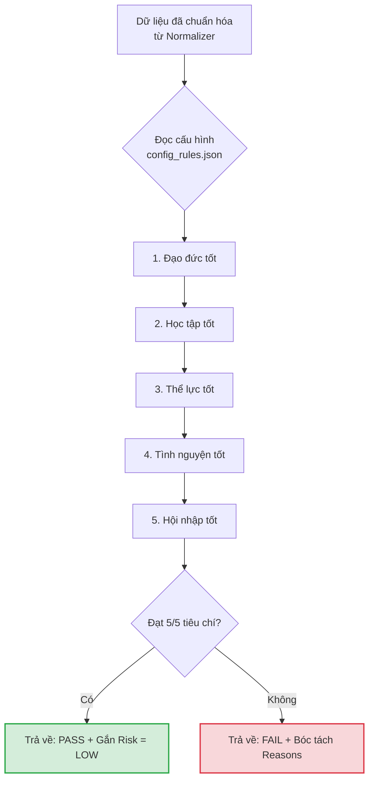

# Tài Liệu Kỹ Thuật: Rule Engine (Bộ Lọc Quy Chế Cứng)
**Dự án:** SV5T Smart - AI-Powered Student Evaluation & Review System  
**Phụ trách module:** Tâm  
**Phiên bản:** 1.0.0  

---

## 1. Tổng quan (Overview)
Module **Rule Engine** (`backend/rules_engine.py`) chịu trách nhiệm thực thi các quy tắc logic (Hard Rules) để đánh giá hồ sơ sinh viên dựa trên bộ Tiêu chuẩn "Sinh viên 5 Tốt" cấp Trung ương. 
Thuật toán chạy hoàn toàn ở Local (CPU), không tốn chi phí API, giúp hệ thống lọc nhanh hàng ngàn hồ sơ và phân loại ngay lập tức thành `[PASS]` hoặc `[FAIL]`, đồng thời bóc tách rõ lý do trượt mốc sàn để phục vụ tính năng giải trình.

## 2. Sơ đồ luồng (Flowchart)



## 3. Cấu trúc dữ liệu (Data Dictionary)

**Đầu vào (Input):** Một Dictionary chứa thông tin sinh viên đã được `UniversalNormalizer` làm sạch và ép kiểu (đảm bảo không còn giá trị NaN hoặc sai kiểu dữ liệu).

**Đầu ra (Output):** Một Dictionary trả về kết quả đánh giá minh bạch:
```json
{
  "student_id": "20520001",
  "is_pass": false,
  "failed_criteria": ["Học tập", "Hội nhập"],
  "reasons": [
    "Tiêu chí Học tập: Thiếu một trong các hoạt động bổ trợ (NCKH / Giải thưởng / Bài báo).",
    "Tiêu chí Hội nhập: Điểm ngoại ngữ (IELTS 5.5) dưới mức sàn 6.0."
  ],
  "risk_level": "HIGH"
}
```

## 4. Thiết lập & Cấu hình (Configuration)
Các tham số điểm sàn **không được fix cứng (hardcode)** trong mã nguồn. Hệ thống nạp tự động từ tệp `backend/config_rules.json`. Nếu Ban tổ chức thay đổi quy chế vào năm sau, chỉ cần cập nhật file này.

Cấu trúc `config_rules.json`:
```json
{
  "min_conduct_score": 90.0,
  "min_gpa": 3.6,
  "min_volunteer_days": 5,
  "min_ielts": 6.0
}
```

## 5. Cơ chế xử lý ngoại lệ (Error Handling & Edge Cases)
* **Lỗi mất file Config:** Nếu hệ thống không tìm thấy `config_rules.json`, Rule Engine sẽ tự động kích hoạt bộ tham số mặc định (Fallback Config) đã được định nghĩa cứng trong class constructor và ghi log cảnh báo.
* **Biên an toàn (Edge Cases):** * Thuật toán sử dụng toán tử `>=` (lớn hơn hoặc bằng) cho mọi phép so sánh điểm số, đảm bảo điểm GPA tròn `3.6` hoặc ĐRL tròn `90` vẫn được ghi nhận là PASS.
    * Cơ chế so sánh linh hoạt (OR condition) được nhóm gọn trong hàm `any()`. Ví dụ: `has_academic_bonus = any([data['research'], data['academic_award'], data['publication']])`.

## 6. Phụ thuộc (Dependencies)
* **Nhận dữ liệu từ:** `backend/normalizer.py`
* **Được điều phối bởi:** `backend/main.py` (Main pipeline sẽ gọi Rule Engine trước khi quyết định có đưa hồ sơ này qua bộ phận AI Reasoning hay không).